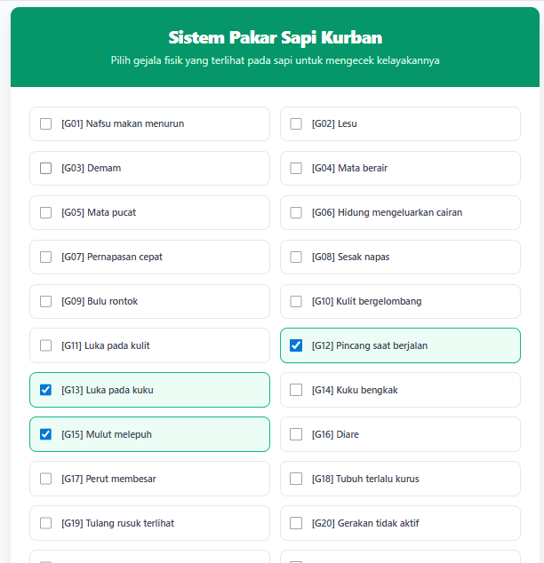
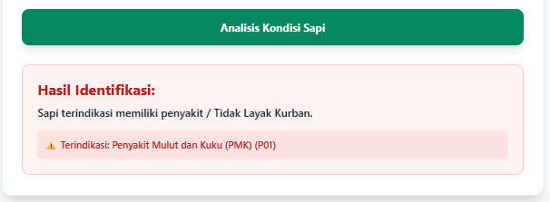
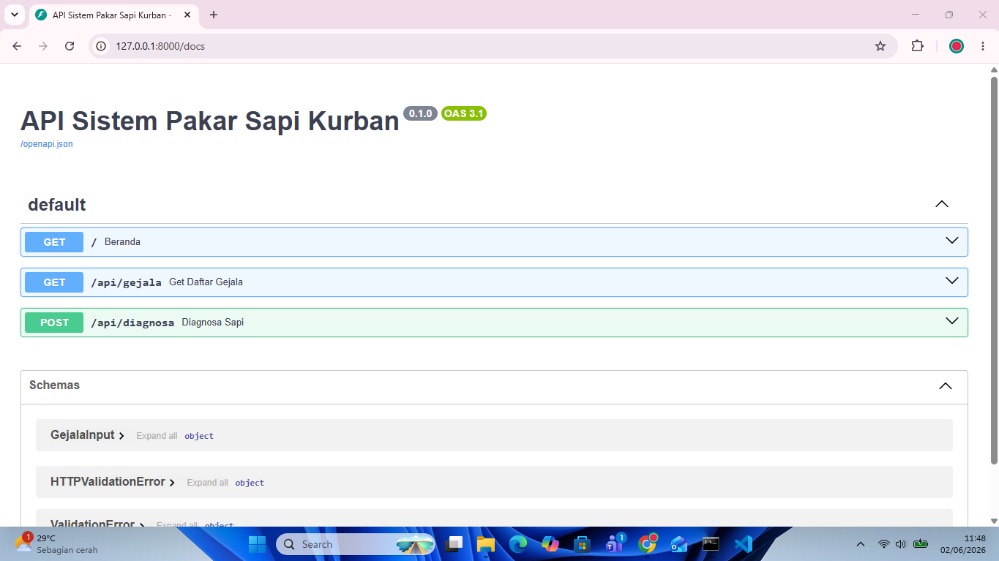
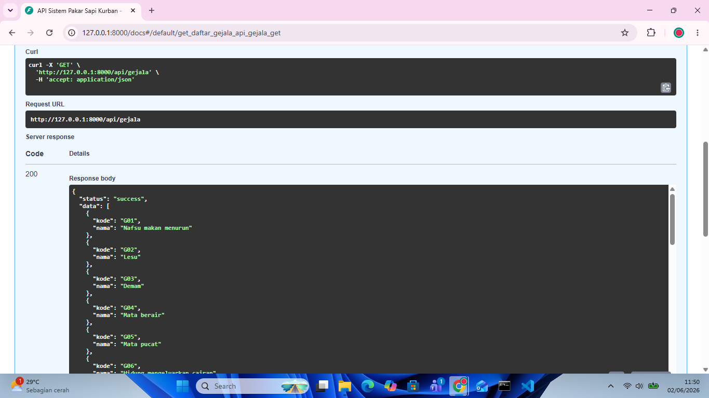
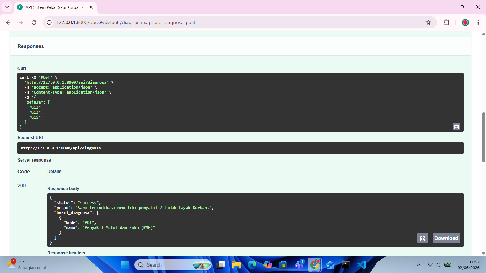

# 🐄 Sistem Pakar Kelayakan Sapi Kurban

Sistem pakar berbasis web untuk mengidentifikasi penyakit dan menentukan status kelayakan sapi kurban menggunakan metode **Forward Chaining**. 

Proyek ini dibangun menggunakan arsitektur *Decoupled* (Terpisah), di mana mesin inferensi logika dan antarmuka pengguna berjalan di ekosistem yang sepenuhnya berbeda namun saling berkomunikasi secara mulus melalui REST API.

---

## 🛠️ Teknologi yang Digunakan

**Backend (Otak & Mesin Inferensi):**
* **Bahasa:** Python 3
* **Framework:** FastAPI
* **Server:** Uvicorn
* **Database:** JSON (Knowledge Base)

**Frontend (Antarmuka Pengguna):**
* **Framework:** Vue.js (via Vite)
* **Styling:** Tailwind CSS
* **HTTP Client:** Axios

---

## 📸 Dokumentasi Antarmuka (Frontend)

Bagian ini menampilkan antarmuka yang digunakan oleh pengguna (peternak atau panitia kurban) untuk berinteraksi dengan sistem.

### 1. Halaman Identifikasi Gejala
Pengguna dapat memilih gejala-gejala fisik yang terlihat pada sapi melalui antarmuka *checkbox* yang bersih dan responsif. Data gejala ditarik secara dinamis dari API.



### 2. Panel Hasil Diagnosis
Setelah tombol analisis ditekan, sistem akan menampilkan hasil inferensi berupa jenis penyakit (jika ada) dan status akhir kelayakan sapi untuk dikurbankan.



---

## ⚙️ Dokumentasi REST API (Backend)

Sistem inferensi berjalan di belakang layar menyediakan beberapa *endpoint* yang terdokumentasi secara otomatis menggunakan Swagger UI bawaan FastAPI.

### 1. Dokumentasi Utama FastAPI
Tampilan halaman utama dokumentasi interaktif (Swagger UI) yang memuat daftar rute yang tersedia.



### 2. Endpoint GET: Daftar Gejala
Rute `GET /api/gejala` berfungsi untuk mendistribusikan data *Knowledge Base* (daftar kode dan nama gejala) ke *Frontend*.



### 3. Endpoint POST: Analisis Penyakit
Rute `POST /api/diagnosa` merupakan inti dari sistem pakar. Rute ini menerima *array* gejala dari *Frontend*, menjalankan algoritma *Forward Chaining*, dan mengembalikan JSON berisi hasil diagnosis.



---

## 🚀 Cara Menjalankan Proyek

Karena menggunakan arsitektur terpisah, Anda perlu menjalankan dua terminal secara bersamaan.

### Menjalankan Backend (FastAPI)
1. Buka terminal dan masuk ke folder `backend`.
2. Aktifkan *virtual environment*:
   ```bash
   env\Scripts\activate

```

3. Jalankan server Uvicorn:
```bash
uvicorn main:app --reload

```


4. API akan berjalan di `http://127.0.0.1:8000`.

### Menjalankan Frontend (Vue.js)

1. Buka terminal baru dan masuk ke folder `frontend`.
2. Instal dependensi (jika baru pertama kali):
```bash
npm install

```


3. Jalankan server Vite:
```bash
npm run dev

```


4. Buka aplikasi web di `http://localhost:5173`.

---

*Develop by group 8 untuk membantu memastikan kesehatan dan kelayakan hewan kurban.*

```

```